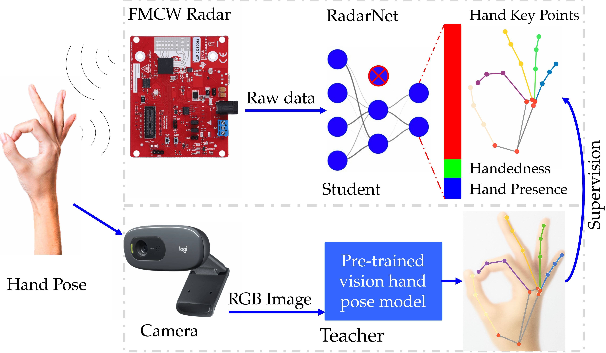

# FMCW-Radar-Hand-Pose-Estimation

This repo contains code and dataset for manuscript: <span style="color:blue"><b> Real-Time Hand Pose Estimation Using FMCW Radar on Resource-Limited Edge Devices </b></span>
<!--<p align="center">
  
</p>
<span style="color:blue"><b>Abstract— </b></span> Real-time hand pose estimation is essential for natural human–computer interaction (HCI), especially in situations where vision-based systems face challenges due to lighting, occlusion, or privacy issues. This paper introduces RadarPose, an innovative framework that estimates 2D hand keypoints for HCI applications using raw Frequency-Modulated Continuous Wave (FMCW) radar signals. To address the difficulty of manually annotating FMCW radar data, a cross-modal supervision strategy is implemented, utilizing synchronized RGB video frames processed by a pre-trained vision model to generate hand keypoint labels for training the radar signals. RadarNet, the core of this framework, is a lightweight convolutional neural network (LCNN) designed to predict 21 hand keypoints, handedness, and hand presence directly from a raw data cube. By removing the Fast Fourier Transform (FFT) stages, this framework facilitates end-to-end learning in the radar complex data domain, resulting in significantly reduced latency. Once trained, the proposed framework relies solely on radar data for inference, ensuring both privacy protection and invariance to lighting conditions. The model comprises only 326k parameters and achieves real-time inference in just 1.19 milliseconds on an NVIDIA Jetson Nano. Experimental results indicate that RadarPose demonstrates competitive accuracy compared to vision-based models in well-lit environments and significantly outperforms them in low-light or occluded scenarios, highlighting its potential for robust, edge-compatible hand pose estimation. The code and dataset are available at https://github.com/thetuantrinh/UWB-Radar-Hand-Pose-Estimation.git.-->

*Index Terms—* Cross-Modal Supervision, Deep Learning, Edge Computing, FMCW Radar, Hand Pose Estimation, TensorRT

## 🎥 Demo
#### 🌙 Demo Results in Dark Scenes
| (a) The poses estimated from FMCW Radar signals | (b) The poses estimated from Camera signals |
|-------------------|--------------------|
|  |  |

<p align="center">
  <em>
    Visual comparison between hand key points estimated by proposed RadarNet model and 
    <a href="https://arxiv.org/abs/2006.10214">MediaPipe Hands</a> 
    on dark scenes.
  </em>
</p>

#### 🔅 Demo Results in Light Scenes
<p align="center">
  
  
</p>

<p align="center">
  <em>
    Visual comparison between hand key points estimated by 
    <a href="https://arxiv.org/abs/2006.10214">MediaPipe Hands</a> 
    and proposed RadarNet model. Blue dots are key points estimated by the visual model while red ones are from RadarNet.
  </em>
</p>

## 🚀 Quickstart
```bash
git clone https://github.com/thetuantrinh/UWB-Radar-Hand-Pose-Estimation.git
cd UWB-Radar-Hand-Pose-Estimation
```

#### 🛠 Environment
The original project was developed on python 3.9.0. We encourage you to create the same python version for reproduce purposes by creating python3.9 with conda by the following script:
```bash
conda create --name HPE python==3.9
conda activate HPE
```
***Then install all required libraries:***
```bash
pip3 install -r requirements.txt
```

#### 📚 Training

⚠️ **Important:** Please update the default dataset directory in `scripts/train_hpc.sh` to the absolute path of your dataset.

##### 1. Structure the project
Before running training scripts, first structure the project by executing:
```bash
bash scripts/structure_project.sh
```
##### 2. Launch training

You can modify training parameters directly in `scripts/train_hpc.sh` (they are passed to `train.py`),  
or simply start training with:

```bash
sbatch scripts/train_hpc.sh
```

#### 📈 Evaluation

After training, you can evaluate the RadarNet model by running:

```bash
bash scripts/eval.sh
```

#### 📊 Tracking Training with Weights & Biases (Wandb)

[Wandb](https://wandb.ai) is a great tool for experiment tracking and visualization.  
Install with pip:
```bash
pip install wandb
``` 

#### ⚠️ Potential Problems (HPC without Internet)

If you're training on a machine without internet connection (e.g., an HPC compute node), Wandb will not work online.  
To fix this, run in **offline mode**:
```bash
wandb offline
```

After training, sync all locally saved Wandb logs to the cloud:
```bash
wandb sync your-local-wandb-log-folder/offline-run*
```
👉 Remeber to replace `your-local-wandb-log-folder` with the path to your actual Wandb logs directory.

### 🧪 Experimental System Environment:

- **Training & Testing:** [AlmaLinux 8.5 (Arctic Sphynx) (NVIDIA DGX A100-SXM4-40GB)](https://wiki.almalinux.org/release-notes/8.5.html)  
- **Inference Deployment:** [NVIDIA Jetson Nano (Tegra X1, Quad-core ARM Cortex-A57 CPU, 128-core Maxwell GPU)](https://developer.nvidia.com/embedded/learn/get-started-jetson-nano-devkit)


